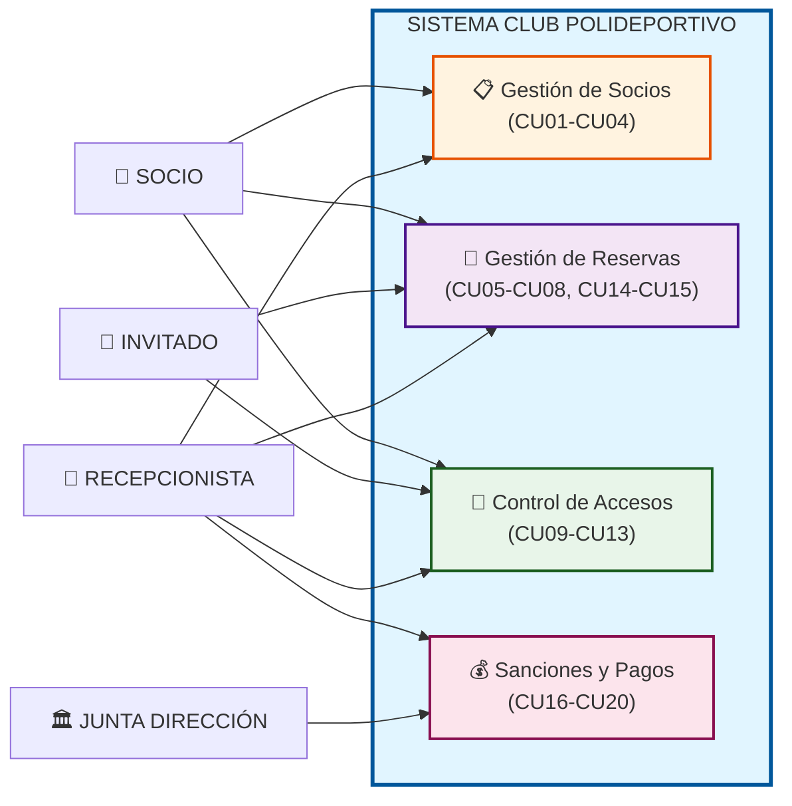
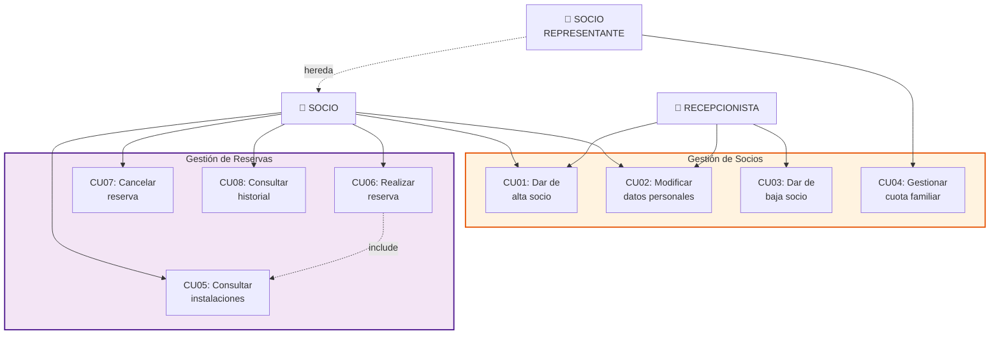
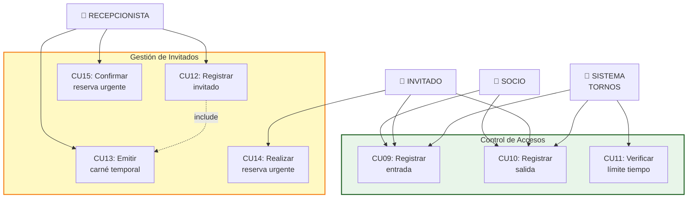
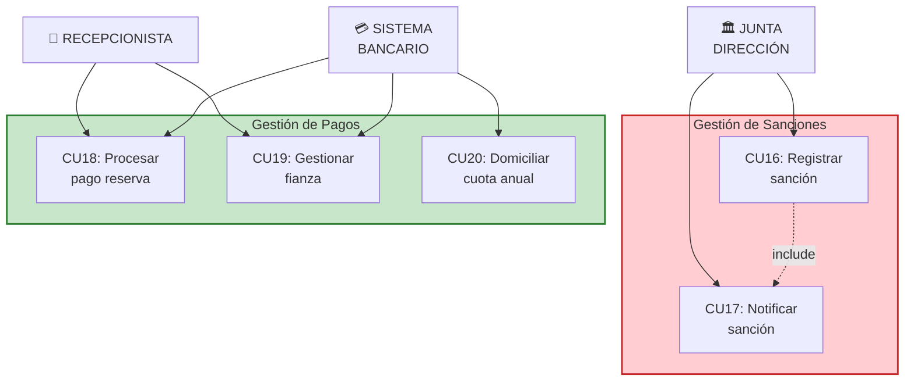
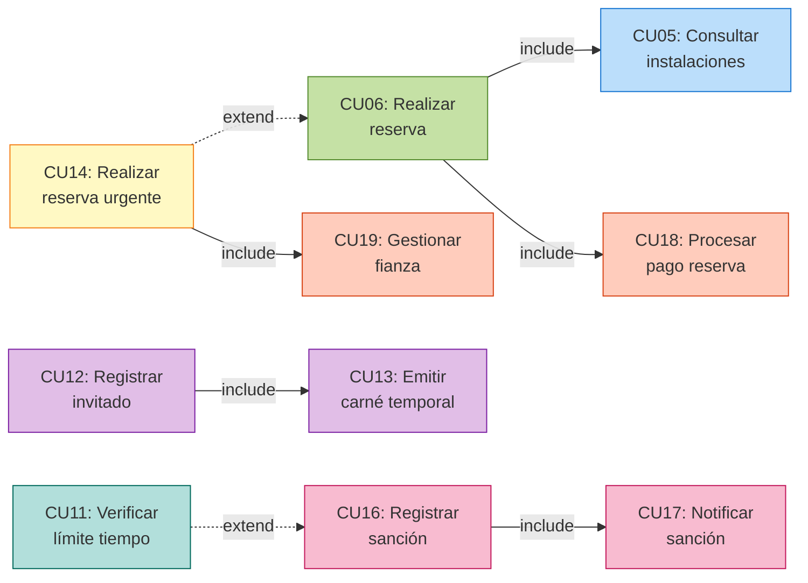
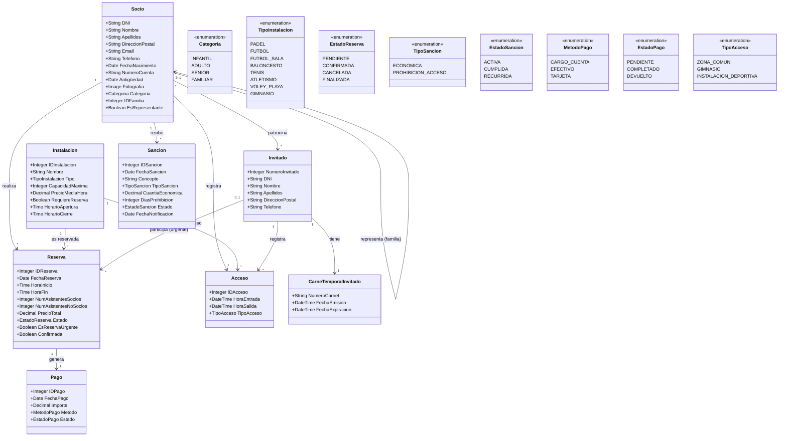

# Captura y Elicitación de Requisitos
## Sistema de Gestión de Reservas - Club Polideportivo Mercantil

---

**Datos del estudiante**

| Campo | Valor |
|-------|-------|
| Nombre y apellidos | [Nombre y apellidos del estudiante] |
| Fecha de entrega | [00/00/0000] |

---

## 1. Análisis Preliminar del Sistema

### 1.1 Identificación de Actores

A partir del análisis del briefing, se identifican los siguientes actores externos que interactúan con el sistema:

| Actor | Descripción |
|-------|-------------|
| **Socio** | Usuario registrado del club que paga cuota anual. Puede realizar reservas, acceder a instalaciones y gestionar su información personal. |
| **Socio Representante** | Socio que actúa como representante de una cuota familiar. Gestiona la correspondencia y proporciona los datos de pago. |
| **Invitado (No-Socio)** | Persona externa que accede al club acompañando a un socio. Puede realizar "reservas urgentes" una vez registrado. |
| **Recepcionista** | Personal del club encargado de registrar invitados, confirmar reservas urgentes y gestionar pagos en efectivo/tarjeta. |
| **Junta de Dirección** | Órgano decisor que impone sanciones a los socios que incumplen las normas del club. |
| **Sistema de Tornos** | Sistema automatizado que controla el acceso a las instalaciones mediante carnés. |
| **Sistema Bancario** | Sistema externo para la domiciliación de cuotas y pagos de reservas. |

### 1.2 Principales Funcionalidades del Sistema

1. **Gestión de Socios**: Alta, baja, modificación de datos personales y gestión de cuotas familiares.
2. **Gestión de Reservas**: Reserva de instalaciones por socios y reservas urgentes por invitados.
3. **Control de Accesos**: Registro de entradas/salidas mediante tornos y verificación de límites de tiempo.
4. **Gestión de Invitados**: Registro, emisión de carnés temporales y vinculación con socios.
5. **Gestión de Sanciones**: Registro, notificación y seguimiento de sanciones.
6. **Gestión de Pagos**: Domiciliación de cuotas, cobro de reservas y gestión de fianzas.

---

## 2. Diagrama de Casos de Uso

### 2.1 Vista General del Sistema

### 2.2 Diagrama Detallado: Gestión de Socios y Reservas

### 2.3 Diagrama Detallado: Control de Accesos e Invitados

### 2.4 Diagrama Detallado: Sanciones y Pagos

### 2.5 Diagrama de Relaciones entre Casos de Uso

### 2.6 Descripción de los Casos de Uso

| ID | Caso de Uso | Descripción | Actor Principal |
|----|-------------|-------------|-----------------|
| CU01 | Dar de alta socio | Registrar nuevo socio en el sistema con todos sus datos personales | Recepcionista |
| CU02 | Modificar datos personales | Actualizar información personal de un socio existente | Socio, Recepcionista |
| CU03 | Dar de baja socio | Eliminar a un socio del sistema | Recepcionista |
| CU04 | Gestionar cuota familiar | Crear/modificar grupo familiar y asignar representante | Socio Representante |
| CU05 | Consultar instalaciones | Ver disponibilidad y precios de las instalaciones | Socio |
| CU06 | Realizar reserva | Reservar una instalación indicando horario y asistentes | Socio |
| CU07 | Cancelar reserva | Anular una reserva previamente realizada | Socio |
| CU08 | Consultar historial | Ver histórico de reservas, accesos y sanciones | Socio |
| CU09 | Registrar entrada | Registrar acceso a instalación mediante torno | Socio, Invitado, Sist. Tornos |
| CU10 | Registrar salida | Registrar salida de instalación mediante torno | Socio, Invitado, Sist. Tornos |
| CU11 | Verificar límite tiempo | Comprobar si socio excede tiempo permitido en gimnasio | Sistema de Tornos |
| CU12 | Registrar invitado | Dar de alta a un invitado con sus datos personales | Recepcionista |
| CU13 | Emitir carné temporal | Generar carné temporal para invitado | Recepcionista |
| CU14 | Realizar reserva urgente | Reservar instalación con máximo 4h de antelación | Invitado |
| CU15 | Confirmar reserva urgente | Validar reserva urgente 30 min antes del evento | Recepcionista |
| CU16 | Registrar sanción | Crear nueva sanción para un socio | Junta de Dirección |
| CU17 | Notificar sanción | Enviar notificación de sanción por email | Junta de Dirección |
| CU18 | Procesar pago reserva | Gestionar cobro de reserva (cargo cuenta/efectivo/tarjeta) | Recepcionista, Sist. Bancario |
| CU19 | Gestionar fianza | Cobrar y devolver fianza de reservas urgentes | Recepcionista, Sist. Bancario |
| CU20 | Domiciliar cuota anual | Cargar cuota anual en cuenta bancaria del socio | Sistema Bancario |

---

## 3. Requisitos de Información

### RI-01: Información de Socio

| Atributo | Tipo | Descripción | Obligatorio |
|----------|------|-------------|-------------|
| DNI | Cadena(9) | Documento Nacional de Identidad | Sí |
| Nombre | Cadena(50) | Nombre del socio | Sí |
| Apellidos | Cadena(100) | Apellidos del socio | Sí |
| Dirección postal | Cadena(200) | Dirección completa | Sí |
| Email | Cadena(100) | Correo electrónico | Sí |
| Teléfono | Cadena(15) | Número de teléfono | Sí |
| Fecha nacimiento | Fecha | Fecha de nacimiento | Sí |
| Número cuenta | Cadena(24) | IBAN para domiciliación | Sí |
| Antigüedad | Fecha | Fecha de alta en el club | Sí |
| Fotografía | Imagen | Foto del socio para carné | Sí |
| Categoría | Enumerado | Infantil, Adulto, Senior | Sí |
| ID Familia | Entero | Identificador de grupo familiar | No |
| Es representante | Booleano | Indica si es representante familiar | No |

**Estructura**: Entidad principal relacionada con Reserva (1:N), Sanción (1:N), Acceso (1:N) e Invitado (1:N).

---

### RI-02: Información de Reserva

| Atributo | Tipo | Descripción | Obligatorio |
|----------|------|-------------|-------------|
| ID Reserva | Entero | Identificador único | Sí |
| ID Socio/Invitado | Entero | Quien realiza la reserva | Sí |
| ID Instalación | Entero | Instalación reservada | Sí |
| Fecha reserva | Fecha | Fecha del evento | Sí |
| Hora inicio | Hora | Hora de inicio | Sí |
| Hora fin | Hora | Hora de finalización | Sí |
| Num. asistentes socios | Entero | Número de socios asistentes | Sí |
| Num. asistentes no-socios | Entero | Número de invitados | Sí |
| Precio total | Decimal | Coste total de la reserva | Sí |
| Estado | Enumerado | Pendiente, Confirmada, Cancelada, Finalizada | Sí |
| Es reserva urgente | Booleano | Indica si es reserva urgente | Sí |
| Confirmada | Booleano | Para reservas urgentes | No |

**Estructura**: Entidad relacionada con Socio (N:1), Instalación (N:1) y Pago (1:1).

---

### RI-03: Información de Sanción

| Atributo | Tipo | Descripción | Obligatorio |
|----------|------|-------------|-------------|
| ID Sanción | Entero | Identificador único | Sí |
| ID Socio | Entero | Socio sancionado | Sí |
| Fecha sanción | Fecha | Fecha de imposición | Sí |
| Concepto | Cadena(500) | Motivo de la sanción | Sí |
| Tipo sanción | Enumerado | Económica, Prohibición acceso | Sí |
| Cuantía económica | Decimal | Importe a pagar (si aplica) | No |
| Días prohibición | Entero | Días sin acceso (si aplica) | No |
| Estado | Enumerado | Activa, Cumplida, Recurrida | Sí |
| Fecha notificación | Fecha | Fecha envío email | Sí |

**Estructura**: Entidad relacionada con Socio (N:1).

---

### RI-04: Información de Instalación

| Atributo | Tipo | Descripción | Obligatorio |
|----------|------|-------------|-------------|
| ID Instalación | Entero | Identificador único | Sí |
| Nombre | Cadena(100) | Nombre de la instalación | Sí |
| Tipo | Enumerado | Pádel, Fútbol, Fútbol Sala, Baloncesto, Tenis, Atletismo, Vóley-playa, Gimnasio | Sí |
| Capacidad máxima | Entero | Número máximo de personas | Sí |
| Precio media hora | Decimal | Precio por cada 30 minutos | Sí |
| Requiere reserva | Booleano | Si necesita reserva previa | Sí |
| Horario apertura | Hora | Hora de apertura | Sí |
| Horario cierre | Hora | Hora de cierre | Sí |

**Estructura**: Entidad relacionada con Reserva (1:N) y Acceso (1:N).

---

## 4. Requisitos No Funcionales

### RNF-01: Seguridad y Protección de Datos

**Descripción**: El sistema debe cumplir con el Reglamento General de Protección de Datos (RGPD) y la LOPDGDD para el tratamiento de datos personales de socios e invitados.

**Especificaciones**:
- Los datos personales deben almacenarse cifrados (AES-256 mínimo).
- El acceso al sistema requiere autenticación mediante usuario y contraseña robusta.
- Las sesiones deben expirar tras 15 minutos de inactividad.
- Se debe mantener un log de auditoría de todas las operaciones sobre datos personales.
- Los datos bancarios (números de cuenta) deben almacenarse tokenizados.

**Justificación**: El sistema almacena datos personales sensibles (DNI, datos bancarios, fotografías) de cientos de socios e invitados. El incumplimiento del RGPD puede conllevar sanciones de hasta 20 millones de euros o el 4% de la facturación anual. Además, una brecha de seguridad dañaría gravemente la reputación del club y la confianza de los socios.

---

### RNF-02: Disponibilidad y Rendimiento

**Descripción**: El sistema debe garantizar una alta disponibilidad para permitir el acceso continuo a las instalaciones y la gestión de reservas.

**Especificaciones**:
- Disponibilidad mínima del 99.5% (máximo 43.8 horas de inactividad al año).
- El sistema de tornos debe responder en menos de 2 segundos para no generar colas.
- Las operaciones de consulta de disponibilidad deben responder en menos de 3 segundos.
- El sistema debe soportar al menos 100 usuarios concurrentes sin degradación del rendimiento.
- Debe existir un sistema de respaldo que permita la continuidad del servicio ante fallos.

**Justificación**: El club opera de 7:00 a 23:00 los 365 días del año. Una caída del sistema impediría el acceso de los socios a las instalaciones (los tornos no funcionarían), generando quejas, pérdida de ingresos por reservas no realizadas y potenciales problemas de seguridad si los tornos quedan bloqueados. La respuesta rápida del sistema de tornos es crítica para evitar aglomeraciones en las horas punta.

---

## 5. Modelo Conceptual de Requisitos de Información

A continuación se muestra el diagrama de clases que representa la estructura de los principales requisitos de información identificados:

---

*Documento elaborado siguiendo la metodología de Ingeniería de Requisitos para el análisis y especificación de sistemas software.*
