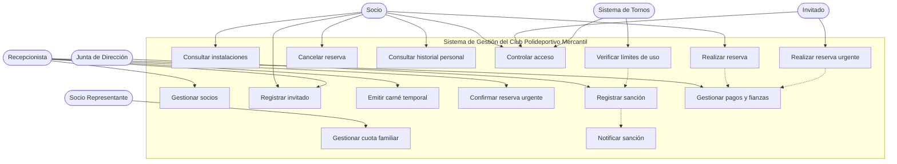
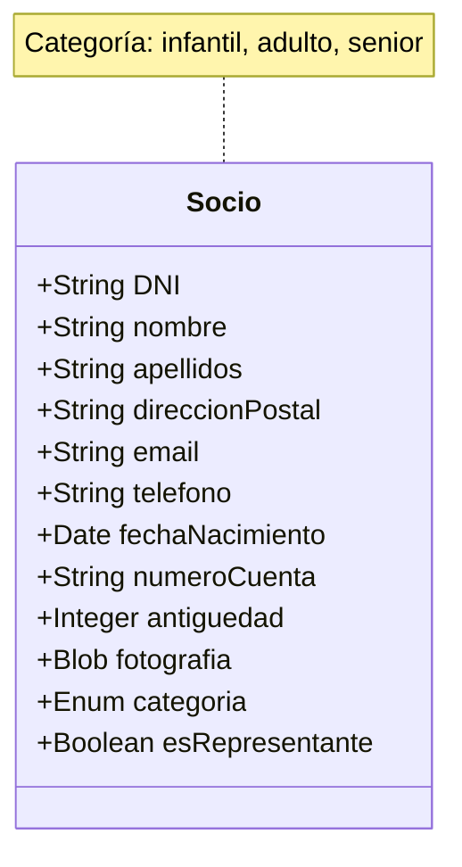
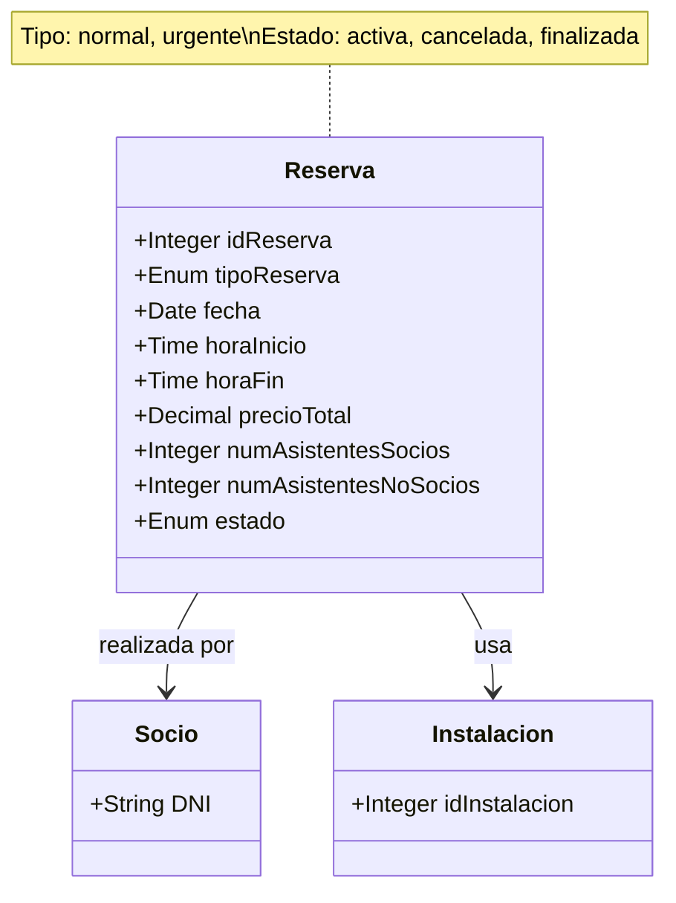
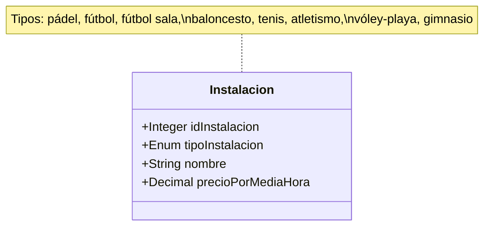
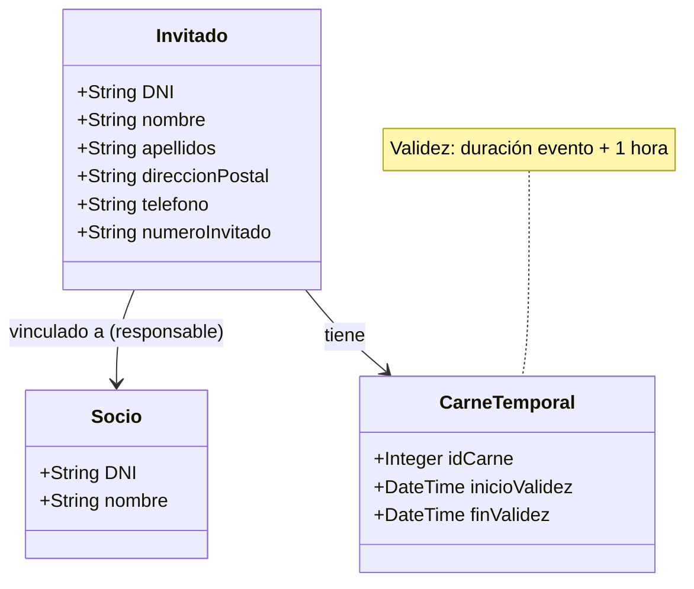
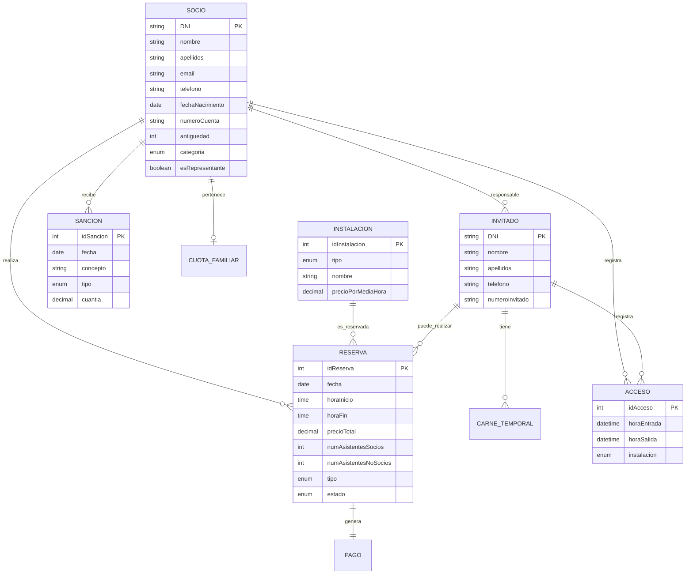

# Captura y elicitación de requisitos

**Nombre y apellidos:** [Nombre del estudiante]  
**Fecha de entrega:** [DD/MM/AAAA]

---

## 1. Análisis del briefing e identificación de actores

A partir del análisis del briefing del **Club Polideportivo Mercantil**, se identifican los siguientes actores externos que interactúan con el sistema:

### Actores identificados

**Socio**  
Usuario registrado del club que paga una cuota anual. Puede realizar reservas, acceder a las instalaciones mediante su carné y consultar su información y su historial.

**Socio representante**  
Socio que actúa como representante de una cuota familiar. Es quien recibe la correspondencia y proporciona el número de cuenta para la domiciliación de la cuota familiar.

**Invitado (no socio)**  
Persona externa que accede al club acompañando a un socio. Debe registrarse en recepción y recibe un carné temporal. Cuando ha acudido al menos una vez, puede obtener un número de invitado y realizar "reservas urgentes" con un máximo de 4 horas de antelación.

**Recepcionista**  
Personal del club encargado de registrar invitados, emitir carnés temporales, confirmar reservas urgentes y gestionar los pagos en efectivo o tarjeta.

**Junta de Dirección**  
Órgano del club que, a partir de los registros de uso de las instalaciones, decide cada lunes las sanciones a aplicar a los socios que incumplen las normas.

**Sistema de tornos**  
Sistema automatizado que controla el acceso a las zonas comunes y a las instalaciones. Registra la hora de entrada y salida al presentar el carné.

---

## 2. Principales funcionalidades del sistema

A partir del briefing se identifican las siguientes funcionalidades principales:

### Gestión de socios y familias
- Alta, modificación y baja de socios
- Gestión de la información personal
- Gestión de cuotas familiares y del socio representante

### Gestión de instalaciones y reservas
- Consulta de instalaciones disponibles y de sus precios por media hora
- Realización y cancelación de reservas por parte de socios
- Cálculo del precio total de la reserva en función del tipo de instalación y el tiempo reservado
- Control del porcentaje de asistentes no socios (nunca más del 50%)

### Control de accesos
- Registro de entradas y salidas mediante los tornos
- Control del tiempo de uso de instalaciones, especialmente el límite de 4 horas semanales de gimnasio para los socios

### Gestión de invitados
- Registro de invitados vinculados a un socio responsable
- Emisión de carnés temporales válidos durante la duración del evento más una hora
- Asignación de número de invitado tras la primera visita

### Gestión de reservas urgentes de no socios
- Permitir que invitados con número de invitado reserven instalaciones si no están ocupadas en las próximas 4 horas
- Confirmación de la reserva urgente en recepción media hora antes del evento
- Anulación automática de la reserva urgente si no se confirma

### Gestión de sanciones
- Registro de sanciones decididas por la Junta de Dirección
- Consulta del historial de sanciones para detectar reiteraciones
- Notificación de sanciones por correo electrónico

### Gestión de pagos y fianzas
- Cargo de las reservas de socios en la cuenta bancaria asociada
- Cobro de reservas urgentes de invitados en efectivo o tarjeta
- Gestión de la fianza de 20 euros asociada a las reservas urgentes

---

## 3. Diagrama de casos de uso

### Descripción de casos de uso principales

| ID | Caso de Uso | Descripción |
|----|-------------|-------------|
| CU01 | Gestionar socios | Permite dar de alta, modificar y dar de baja a los socios del club |
| CU02 | Gestionar cuota familiar | Permite configurar la cuota familiar y designar al socio representante |
| CU03 | Consultar instalaciones | Permite consultar la disponibilidad y precios de las instalaciones |
| CU04 | Realizar reserva | Permite a un socio reservar una instalación indicando fecha, hora y número de invitados |
| CU05 | Cancelar reserva | Permite cancelar una reserva previamente realizada |
| CU06 | Consultar historial personal | Permite a un socio consultar sus reservas, accesos y sanciones |
| CU07 | Controlar acceso | Registra la entrada y salida de socios e invitados mediante tornos |
| CU08 | Verificar límites de uso | Verifica que no se superen los límites de tiempo establecidos (ej: 4h gimnasio/semana) |
| CU09 | Registrar invitado | Registra los datos personales de un invitado y lo vincula a un socio responsable |
| CU10 | Emitir carné temporal | Emite un carné temporal para un invitado con validez limitada |
| CU11 | Realizar reserva urgente | Permite a un invitado con número reservar instalaciones con 4h de antelación máxima |
| CU12 | Confirmar reserva urgente | Confirma una reserva urgente en recepción media hora antes del evento |
| CU13 | Registrar sanción | Registra las sanciones decididas por la Junta de Dirección |
| CU14 | Notificar sanción | Envía notificación por email de las sanciones aplicadas |
| CU15 | Gestionar pagos y fianzas | Gestiona los cargos en cuenta, pagos en efectivo/tarjeta y fianzas |

---

## 4. Requisitos de información

### RI-01: Información de Socio

**Descripción:**  
Datos necesarios para identificar a cada socio, gestionar su relación con el club y realizar los cobros.

**Atributos:**

**Estructura:**  
Un socio puede estar asociado a una cuota familiar, puede realizar muchas reservas, puede tener varios invitados vinculados y puede recibir varias sanciones.

---

### RI-02: Información de Reserva

**Descripción:**  
Datos necesarios para gestionar la reserva de una instalación por parte de un socio o de un invitado con número de invitado.

**Atributos:**

**Estructura:**  
Cada reserva está asociada a una instalación concreta y a un socio (o invitado con número de invitado). La reserva utiliza el precio por media hora de la instalación para calcular el precio total.

---

### RI-03: Información de Instalación

**Descripción:**  
Datos de cada instalación deportiva del club, necesarios para identificarla y calcular el precio de las reservas.

**Atributos:**

**Estructura:**  
Una instalación puede tener asociadas muchas reservas. El tipo de instalación suele determinar el precio por media hora.

**Instalaciones del club:**
- 4 pistas de pádel
- 3 campos de fútbol
- 2 campos de fútbol sala
- 2 canchas de baloncesto
- 4 pistas de tenis
- 1 pista de atletismo
- 1 pista de vóley-playa
- 1 gimnasio

---

### RI-04: Información de Invitado y Carné Temporal

**Descripción:**  
Datos de invitados que acceden al club acompañando a un socio y de los carnés temporales que se les asignan.

**Atributos:**

**Estructura:**  
Cada invitado se vincula a un único socio responsable. Un invitado puede tener varios carnés temporales y, cuando dispone de número de invitado, puede realizar reservas urgentes.

---

## 5. Requisitos no funcionales

### RNF-01: Seguridad y confidencialidad de los datos

**Descripción:**  
El sistema debe proteger los datos personales y bancarios de socios e invitados, de forma que solo el personal autorizado pueda acceder a ellos.

**Especificación:**
- El acceso al sistema debe requerir autenticación mediante usuario y contraseña
- Los distintos perfiles de usuario (recepción, Junta, etc.) solo podrán ver y modificar la información necesaria para su trabajo
- Se debe registrar quién realiza altas, modificaciones y eliminaciones de datos sensibles

**Justificación:**  
El sistema almacena datos personales (DNI, dirección, teléfono, fecha de nacimiento) y datos bancarios de los socios, así como información sobre sanciones. Es imprescindible garantizar la confidencialidad y un acceso controlado para evitar usos indebidos de la información y cumplir con la normativa de protección de datos personales.

---

### RNF-02: Disponibilidad del sistema durante el horario del club

**Descripción:**  
El sistema debe estar disponible y responder de forma adecuada durante el horario de apertura del club.

**Especificación:**
- El sistema debe permitir el uso de los tornos de acceso sin interrupciones prolongadas
- Las operaciones de consulta de disponibilidad y creación de reservas deben responder en un tiempo razonable para no generar colas en recepción
- El sistema debe mantener la integridad de los datos ante fallos y permitir su recuperación

**Justificación:**  
El club utiliza el sistema de forma continua para controlar accesos, gestionar reservas y registrar pagos. Si el sistema deja de funcionar, los socios podrían no acceder a las instalaciones y no se podrían gestionar las reservas ni la fianza de las reservas urgentes, afectando gravemente al servicio prestado y generando insatisfacción en los usuarios.

---

## 6. Resumen del modelo conceptual

---

## Conclusiones

Este documento presenta la captura y elicitación de requisitos del Sistema de Gestión de Reservas del Club Polideportivo Mercantil, identificando:

- **6 actores principales** que interactúan con el sistema
- **15 casos de uso** que cubren las funcionalidades principales
- **4 requisitos de información** con sus atributos y estructura
- **2 requisitos no funcionales** debidamente justificados

El análisis se ha basado estrictamente en la información proporcionada en el briefing inicial, estableciendo una base sólida para la posterior especificación detallada del sistema.
